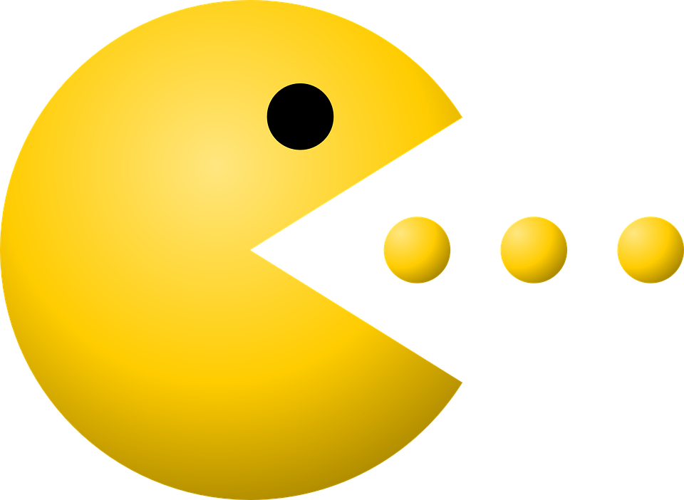
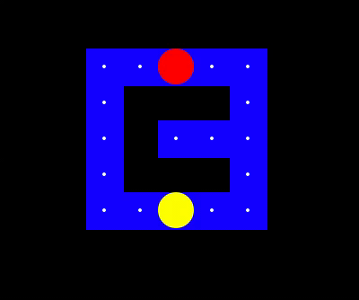
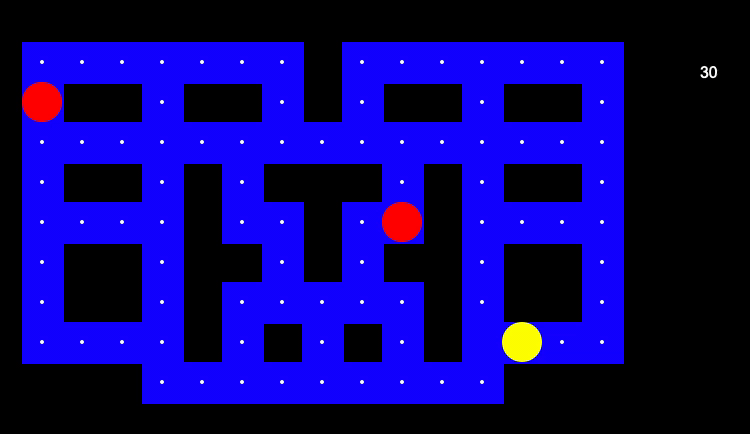

# Pac-Man 

This is our Project for the CentraleSupelec's Reinforcement Learning course, a Pac-Man. The
purpose of this work was to train in the best way possible different agents (Q-
Learning, Expected-Sarsa, Deep Q-Learning) in a Reinforcement Learning environ-
ment of the Game Pac-Man.
<p align="center">

</p>

## Authors 🧠

- Chloé Daems
- Anne-Claire Laisney
- Amir Mahmoudi

## Requirements 💻
Python 3.9
- matplotlib
- numpy
- turtle

## Getting Started 🐣

You can see our pipeline in the .ipynb file with the trainings and results of the Q learning and expected Sarsa Agents;
If you want to try our DQN.py, you can run the following command on the terminal :
```
$ python DQN.py

```

## Some Results 💰

Here you can find examples of the turtle render for the small and medium grids for the trained Sarsa Agent.
<p align="center">

</p>
<p align="center">

</p>

## Implementation ✍️
 You can find the details of agents implementations in our report: 'PacMan_Report.pdf'.


